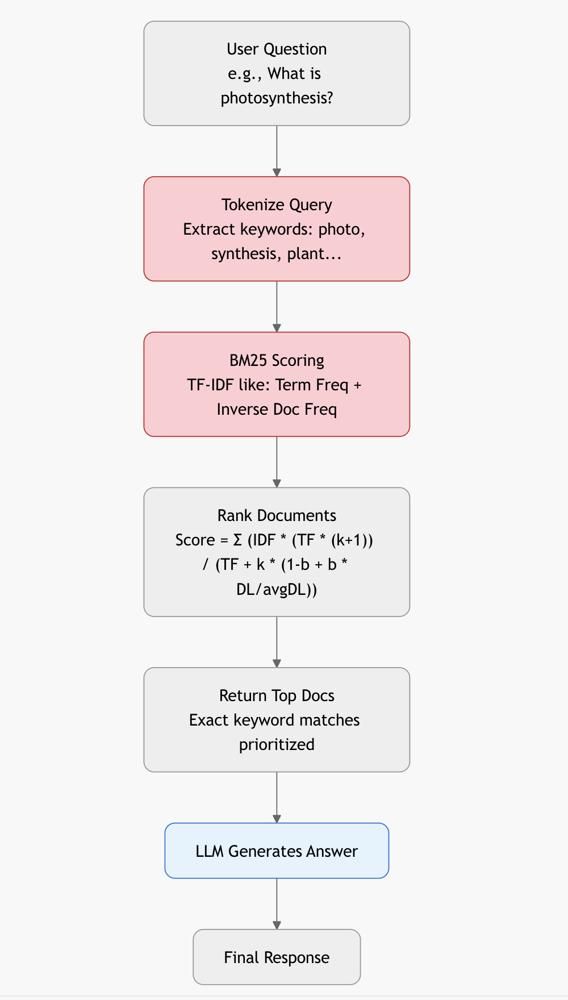
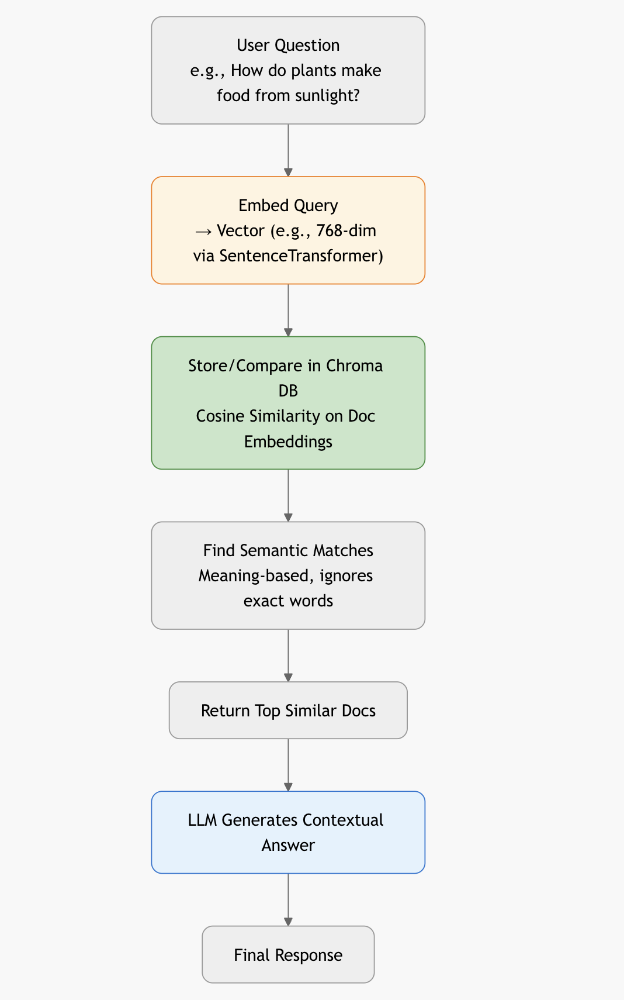
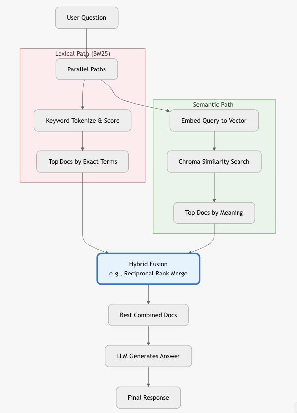

# Search Demo

A demonstration of three types of search for chatbots using Ollama and LangChain:
- **Lexical Search** (BM25)
- **Semantic Search** (Chroma + Embeddings)
- **Hybrid Search** (Ensemble: BM25 + Chroma)

## Prerequisites

1. Install [Ollama](https://ollama.ai/)
2. Pull the model:
   ```bash
   ollama pull llama3.2:1b
   ```

## Installation

```bash
pip install -r requirements.txt
```

## Usage

### Lexical Search (BM25)

<p align="center">
  
</p>

```bash
python3 lexical_search.py
```
Uses BM25 algorithm for keyword-based document retrieval.

### Semantic Search (Chroma + Embeddings)

<p align="center">
  
</p>

```bash
python3 semantic_search.py
```
Uses vector embeddings to find semantically similar documents.

### Hybrid Search (Ensemble)

<p align="center">
  
</p>

```bash
python3 hybrid_search.py
```
Combines BM25 and semantic search for better retrieval accuracy.

## Project Structure

- `data.py`: Sample documents for search demonstrations
- `lexical_search.py`: BM25 lexical search implementation
- `semantic_search.py`: Semantic search with Chroma vector store
- `hybrid_search.py`: Hybrid search combining both approaches
- `requirements.txt`: Python dependencies

## How It Works

Each demo:
1. Loads sample documents from `data.py`
2. Implements a specific search strategy
3. Provides an interactive chatbot that:
   - Takes user queries
   - Retrieves relevant documents
   - Generates answers using Ollama's `llama3.2:1b` model

Try asking questions like:
- "What is photosynthesis?"
- "Tell me about the Eiffel Tower"
- "What is machine learning?"
